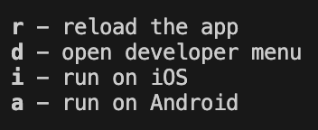

# Software engineering: implementation and testing
## Evaluative assignment 2024/1

### Goal
Develop an app or website that allows people to exchange books with each other.

### Technologies
- Frontend: ReactNative
- Backend: Java with SpringBoot
- Database: h2

### Pre requirements
#### Frontend
- Node version `18.16.0`
#### Backend
- Java `18` or docker (to run the API with a docker container)

### How to emulate the app
**Make sure you have either a iOS or an Android emulator configured**
1. From the projects root folder `/Biblioteca` run the command `yarn` to install the dependencies.
2. From the `ios/` folder run the command `pod install`.
3. Back to the the project's root folder run the command `npm run start`.

    In the console you will be presented with a few options, select the one corresponding to the emulator that you have configured and the app will be installed and started automatically.
    

    If you already have the app installed in the emulator, there is no need to reinstall it by selecting an option, just open the app in the emulator and it will be using the bundle currently running.

